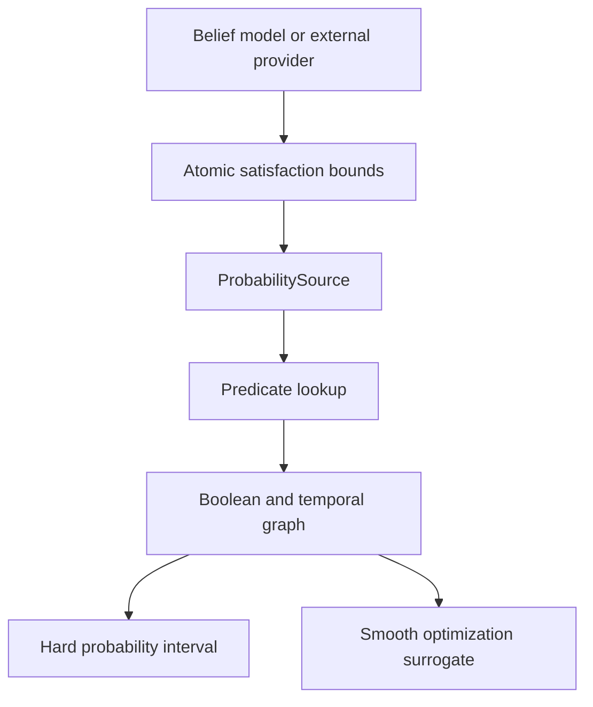

# How the Current pdSTL Mechanism Works

This document explains the mechanism currently implemented on the `RA_L`
branch. It describes what enters the pdSTL graph, how probability intervals
are propagated through Boolean and temporal operators, how offline and
streaming evaluation share the same computation, and where the present scope
ends.

The current implementation is a **probability-bound STL monitor**. It accepts
bounds on the satisfaction probability of atomic predicates and returns bounds
on the satisfaction probability of composed, bounded-time STL formulas. It
does not assume independence between predicate events.

## 1. End-to-end view



At discrete time `t`, the pdSTL core expects an atomic interval

$$
I_t=[\underline p_t,\overline p_t],
$$

where

$$
\underline p_t\leq P(B_t)\leq\overline p_t,
$$

and $B_t$ is the event that the atomic predicate is **satisfied** at time
$t$. An exact probability is represented by $[p_t,p_t]$.

The tensor convention is:

| Object | Shape | Meaning |
|---|---:|---|
| One atomic interval | `[B, 2]` | batch × `[lower, upper]` |
| Complete trace | `[B, T, 2]` | batch × time × bounds |
| Temporal state | `[B, h, 2]` | batch × retained history × bounds |
| Formula output | `[B, T_out, 2]` | interval at each valid STL anchor |

Every hard result must satisfy

$$
0\leq\underline p\leq\overline p\leq1.
$$

`validate_bounds()` in `src/pdstl/base.py` enforces this input contract.

## 2. Where atomic probabilities come from

The pdSTL core deliberately begins at probability intervals. It does not
require a particular distribution, state estimator, or chance-constraint
model. A probability provider is responsible for converting its available
belief information into atomic satisfaction bounds.

### Gaussian altitude example

The implemented drone example uses

$$
Z_t\mid\mu_t\sim\mathcal N(\mu_t,\sigma_t^2),
\qquad
\mu_t\in[\mu_t^\downarrow,\mu_t^\uparrow].
$$

For the predicate $Z_t\geq h$, monotonicity with respect to the Gaussian mean
gives

$$
\underline p_t=
\Phi\!\left(\frac{\mu_t^\downarrow-h}{\sigma_t}\right),
\qquad
\overline p_t=
\Phi\!\left(\frac{\mu_t^\uparrow-h}{\sigma_t}\right).
$$

This conversion is implemented in `src/models/drone.py`. Here the interval is
over the Gaussian **mean parameter**; it is not an interval containing every
possible altitude realization.

The example is one possible upstream model. Other providers may use particle
beliefs, empirical frequencies, conformal bounds, distributionally robust
bounds, or probabilities supplied directly by another system.

### Satisfaction versus violation

The core always consumes **satisfaction** bounds. If an upstream chance
constraint returns violation bounds

$$
\underline v_t\leq P(g(S_t)>0)\leq\overline v_t,
$$

for the desired event $B_t=\{g(S_t)\leq0\}$, it must convert them using

$$
[\underline p_t,\overline p_t]
=
[1-\overline v_t,\;1-\underline v_t].
$$

Passing a violation interval directly to `Predicate` would reverse the
meaning of the formula.

## 3. Probability sources and predicates

`ProbabilitySource` is the boundary between upstream probability generation
and the STL graph. It defines two operations:

```python
source.bounds(predicate, time)  # Tensor[B, 2]
len(source)                     # currently available time steps
```

There are two implementations:

- `OfflineSource` stores complete traces keyed by predicate.
- `OnlineSource` grows one time step at a time through `append()`.

A `Predicate` does not recalculate a probability. It queries its source at
each available time and stacks the returned intervals into `[B, T, 2]`.
Consequently, belief-to-probability conversion belongs upstream of the
predicate node.

## 4. Boolean operators

Boolean nodes combine aligned interval traces pointwise in time. Fréchet
bounds are used because dependence between the events is unknown.

For $A\in[\underline a,\overline a]$ and
$B\in[\underline b,\overline b]$:

### Negation

$$
P(\neg A)
\in
[1-\overline a,\;1-\underline a].
$$

### Conjunction

$$
P(A\cap B)
\in
\left[
\max(0,\underline a+\underline b-1),
\min(\overline a,\overline b)
\right].
$$

### Disjunction

$$
P(A\cup B)
\in
\left[
\max(\underline a,\underline b),
\min(1,\overline a+\overline b)
\right].
$$

These equations are written directly inside `Not.step()`, `And.step()`, and
`Or.step()` in `src/pdstl/operators.py`. No product of probabilities is used,
so the implementation does not silently introduce independence.

## 5. Bounded temporal windows

For a formula evaluated at anchor `k` with interval `[a,b]`, the active child
times are

$$
k+a,k+a+1,\ldots,k+b.
$$

The window has

$$
n=b-a+1
$$

operands. A child trace of length $T$ produces

$$
T_{out}=\max(T-b,0)
$$

complete outputs. Incomplete future windows are not padded.

### Always

`Always(child, (a,b))` is the intersection of all child events in the
window. If their bounds are $[\underline p_i,\overline p_i]$, the output is

$$
\underline P_{\Box}
=
\max\!\left(0,\sum_{i=a}^{b}\underline p_i-(n-1)\right),
$$

$$
\overline P_{\Box}
=
\min_{i=a,\ldots,b}\overline p_i.
$$

This is the finite-intersection Fréchet bound.

### Eventually

`Eventually(child, (a,b))` is the union of the child events:

$$
\underline P_{\Diamond}
=
\max_{i=a,\ldots,b}\underline p_i,
$$

$$
\overline P_{\Diamond}
=
\min\!\left(1,\sum_{i=a}^{b}\overline p_i\right).
$$

This is the finite-union Fréchet bound.

### Until

The implementation uses bounded strong Until with the overlapping STLCG
convention:

$$
L\;\mathcal U_{[a,b]}\;R.
$$

At a possible right-event offset $j\in[a,b]$, it constructs the candidate

$$
C_j=
\left(\bigcap_{i=0}^{j}L_{k+i}\right)\cap R_{k+j}.
$$

The left event therefore also holds at the time the right event occurs. The
code applies finite-intersection bounds inside every candidate and then
finite-union bounds across

$$
\bigcup_{j=a}^{b}C_j.
$$

All candidates share the left prefix from offset `0` through `a`. The current
implementation uses this common event to tighten the final upper bound.

## 6. The recurrent mechanism

The temporal modules are PyTorch modules, but they do not store hidden state
inside themselves. The caller owns the activation:

```python
output, new_state = operator.step(current_bounds, state)
```

For `Always` and `Eventually`, `state` is the raw recent child trace:

$$
h_t=
\big(I_{t-h+1},\ldots,I_t\big),
\qquad h\leq b+1.
$$

On each arrival, `step()`:

1. appends the new `[B,2]` interval;
2. keeps only the latest `b+1` entries;
3. returns `None` while the required window is incomplete;
4. selects state positions `a` through `b`;
5. reduces that window using the operator's Fréchet equations.

For `Until`, `UntilState` retains separate raw windows for the left and right
children.

Keeping raw window entries is necessary for sliding evaluation. When an old
entry expires, a monitor must remove it and recompute the next window. A
single reduced interval generally cannot recover information lost through
`min`, `max`, or clamping.

### Output timing

For `[0,2]`, the streaming sequence is:

| Arrival | Retained values | Output |
|---:|---|---|
| `t=0` | `0` | window filling |
| `t=1` | `0,1` | window filling |
| `t=2` | `0,1,2` | anchor `k=0`, window `[0,2]` |
| `t=3` | `1,2,3` | anchor `k=1`, window `[1,3]` |
| `t=4` | `2,3,4` | anchor `k=2`, window `[2,4]` |

Thus, at arrival `t`, a completed output corresponds to anchor

$$
k=t-b.
$$

It is a bounded sliding-window result, not necessarily the probability of
remaining compliant from time zero through the current arrival.

## 7. Sliding-window state versus cumulative-prefix state

For the single cumulative event

$$
A_t=B_0\cap B_1\cap\cdots\cap B_t,
$$

one may recursively store only

$$
[\underline P_t,\overline P_t]
$$

using

$$
\underline P_t=
\max(0,\underline P_{t-1}+\underline p_t-1),
$$

$$
\overline P_t=
\min(\overline P_{t-1},\overline p_t).
$$

This recurrence and the direct finite-intersection equation produce the same
final result for one complete horizon `[0,T]`.

They are not the same state architecture:

| Cumulative prefix monitor | Current bounded STL monitor |
|---|---|
| Never removes an old event | Drops events that leave the window |
| State can be one interval | State retains the raw recent intervals |
| Can emit after every arrival | Emits when the complete `[a,b]` window exists |
| Evaluates `[0,t]` | Evaluates `[k+a,k+b]` at every valid anchor `k` |

The current code implements the right-hand column. For `Always[0,T]`
evaluated once after the full horizon arrives, its output still bounds the
probability that the complete trajectory satisfies the specification.

## 8. Offline and streaming are the same graph

Offline evaluation does not use a separate temporal semantics. A temporal
operator's `forward()` method:

1. evaluates its child over the complete source;
2. unbinds the trace into individual arrivals;
3. repeatedly calls the same `step()` transition used online;
4. stacks every completed output.

The streaming examples call `step()` directly as new intervals arrive. Their
tests verify

$$
\text{streaming outputs}=\text{offline outputs}
$$

for every completed window. Offline and streaming differ only in when data
become available, not in the formula graph or probability equations.

## 9. Formula composition

Every formula inherits from `torch.nn.Module`, so formulas form ordinary
computation graphs. For example,

```python
safe = Predicate("safe")
goal = Predicate("goal")

mission = Always(safe, (0, 2)) & Eventually(goal, (0, 2))
mission_bounds = mission(source)
```

The two temporal branches first produce aligned output traces. `And` then
combines each aligned pair with its conjunction Fréchet bounds.

Nested temporal operators also compose. Each bounded operator shortens the
available trace according to its right endpoint `b`, so the output length of
a nested graph reflects all required future windows.

## 10. Hard and smooth evaluation

Every formula supports two modes.

### Hard mode

```python
result = formula(source)
```

Hard mode uses exact `minimum`, `maximum`, and `clamp` operations. Its output
is the implemented dependence-agnostic probability enclosure and is the mode
used for monitoring, testing, and final reporting.

### Smooth mode

```python
surrogate = formula(source, smooth=True, beta=20.0)
```

Smooth mode replaces:

- $\max(0,z)$ with softplus;
- maximum reductions with log-sum-exp;
- minimum reductions with negative log-sum-exp.

This lets gradients reach more inputs in flat or winner-take-all regions.
The result is an **optimization surrogate**, not a certified probability
interval: ordinary log-sum-exp can overestimate a maximum, underestimate a
minimum, leave `[0,1]`, or disturb lower/upper ordering. Any optimized
trajectory must therefore be reevaluated in hard mode.

The current branch provides this differentiable graph, but it does not yet
contain the trajectory optimizer that consumes the smooth lower score.

## 11. How to run and inspect the mechanism

`src/main.py` is the single entry point:

```bash
python src/main.py
```

`src/main.py` uses literal `"run"` and `"skip"` flags to select the
demonstrations. `configs/examples.yml` contains their numerical and display
parameters. The four top-level demonstrations are:

- Boolean hand calculations;
- Gaussian-belief `Always` and `Eventually` in one offline block;
- a static or animated streaming `Always` monitor;
- offline and streaming `Until`.

Additional composed and sliding runners remain in the repository as focused
test fixtures, but they are not separate top-level `main.py` demonstrations.

The model files create inputs, experiment files connect models to formulas,
and visualization files present results. `main.py` only chooses which
experiment to run.

## 12. What is and is not currently established

### Implemented and tested

- validated satisfaction-probability interval inputs;
- exact-probability inputs represented as `[p,p]`;
- dependence-agnostic Boolean Fréchet propagation;
- bounded `Always`, `Eventually`, and overlapping strong `Until`;
- one computation mechanism shared by offline and streaming use;
- raw sliding-window recurrent states;
- nested and branched formula graphs;
- hard semantics and differentiable smooth surrogates;
- numerical agreement between streaming and offline outputs.

### Not yet implemented

- a generic state-envelope-to-probability conversion layer;
- an explicit violation-to-satisfaction adapter;
- an optional cumulative-prefix monitor that emits `[P_lower,P_upper]` after
  every arrival;
- dependence information tighter than Fréchet bounds;
- trajectory dynamics, control variables, and a planner;
- optimization of the smooth lower satisfaction score;
- hard post-optimization feasibility checking and plan selection.

The next development stage should start from this boundary: the monitoring
graph exists, while the choice of smooth semantics and its connection to the
trajectory-optimization objective still need to be fixed deliberately.

## 13. Relevant files

| File | Responsibility |
|---|---|
| `src/pdstl/base.py` | probability-source interface and interval validation |
| `src/pdstl/operators.py` | predicates, Boolean operators, temporal cells, hard/smooth reductions |
| `src/models/drone.py` | Gaussian-belief-to-atomic-probability example |
| `src/models/streaming.py` | small supplied probability traces |
| `src/experiments/offline.py` | Boolean and offline temporal demonstrations |
| `src/experiments/streaming.py` | sliding and incremental evaluation |
| `src/experiments/mission.py` | composed branched formula graph |
| `src/experiments/until.py` | offline and streaming Until example |
| `src/visualization/` | plots and streaming animation |
| `configs/examples.yml` | run switches and example settings |
| `tests/` | hand calculations, invariants, gradients, and offline/online equality |
